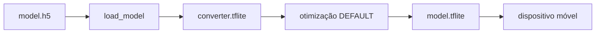

# Processo Seletivo – Intensivo Maker | AI

Bem-vindo(a) à **etapa prática do processo seletivo para o Intensivo Maker**.

Esta atividade tem como objetivo avaliar competências técnicas relacionadas a **Machine Learning**, **Visão Computacional** e **Otimização de modelos para sistemas embarcados (Edge AI)**, a partir da aplicação prática dos conhecimentos adquiridos nos cursos EAD da etapa anterior.

> 🎯 **Importante**  
> O foco deste desafio é avaliar sua capacidade de **projetar, treinar e otimizar um modelo de IA**.  

---

## 📌 Navegação Rápida

- 🏁 [Passo 0 – Antes de Tudo](#-passo-0-antes-de-tudo)
- ⚙ [Passo 1 – Preparando o Ambiente](#-passo-1-preparando-o-ambiente)
- 💻 [Passo 2 – O Desafio Técnico](#-passo-2-o-desafio-técnico)
  - 🎯 [Conjunto de Dados](#-conjunto-de-dados)
  - 📂 [Estrutura do Projeto](#-estrutura-do-projeto)
  - 📚 [Material de Apoio](#-material-de-apoio)
  - ⚖️ [Critérios de Avaliação](#️-critérios-de-avaliação)
- 📤 [Passo 3 – Instruções de Entrega](#-passo-3-instruções-de-entrega)
  - 📝 [Relatório do Candidato](#-relatório-do-candidato)

---

## 🏁 Passo 0: Antes de Tudo

Caso você **nunca tenha utilizado Git ou GitHub**, não se preocupe.  
Siga atentamente as etapas abaixo.


### 1️⃣ Criação de Conta no GitHub

1. Acesse: https://github.com  
2. Clique em **Sign up**  
3. Crie sua conta gratuita seguindo as instruções da plataforma  

(*O GitHub será utilizado para envio, versionamento e correção automática do seu projeto.*)


### 2️⃣ Instalação do Git

O **Git** é a ferramenta que permite versionar e enviar seu código para o GitHub.

- **Windows**  
  Baixe e instale o **Git Bash**:  
  https://git-scm.com/downloads

- **Linux / macOS**  
  Verifique se o Git já está instalado:
  ```bash
  git --version
  ```

---

## ⚙ Passo 1: Preparando o Ambiente

Para desenvolver o desafio, você deverá criar uma cópia deste repositório.

### 1️⃣ Fork do Repositório


1. No canto superior direito desta página, clique em **Fork**  
2. Uma cópia deste repositório será criada no **seu perfil do GitHub**
(*O Fork permite que você trabalhe de forma independente sem alterar o repositório original.*)


### 2️⃣ Clone do Repositório


No repositório do **seu Fork**, clique em **<> Code**, copie a URL e execute:

```bash
git clone https://github.com/SEU_USUARIO/nome-do-repositorio.git
cd nome-do-repositorio
```
(*O comando `git clone` cria uma cópia do repositório.*)


### 3️⃣ Preparação do Ambiente de Execução

Você pode executar o projeto de **Três formas**. Escolha apenas uma.


#### Opção A – Ambiente Python Local 
Requisitos:
- Python **3.10 ou 3.11**
- pip

Instale as dependências com:

```bash
pip install -r requirements.txt
```


#### Opção B – Dev Container 
Este repositório inclui um **Dev Container** para facilitar a criação de um ambiente Python padronizado.

**Requisitos**
- VS Code
- Docker instalado
- Extensão **Dev Containers**

**Passos**
1. Abra o repositório no VS Code  
2. Selecione **“Reopen in Container”**  
3. Aguarde a criação automática do ambiente  

➡️ As dependências serão instaladas automaticamente.


#### Opção C - via browser
Você também pode abrir o container via github codespace

1. Clique em **<> Code**
2. Clique em **Codespaces**
3. Clique em **Create codespace on image**


>  Será aberto uma instância do VS Code no seu navegador com o container configurado


---

## 💻 Passo 2: O Desafio Técnico

O desafio consiste em desenvolver um **modelo de Visão Computacional** capaz de **classificar dígitos manuscritos**, e posteriormente **otimizá-lo para execução em dispositivos Edge**, como sistemas embarcados e IoT.

O foco não é apenas obter alta acurácia, mas também **compreender o fluxo completo**:

**treinamento → salvamento → conversão → otimização**


### 🎯 Conjunto de Dados

Será utilizado o dataset **MNIST**, composto por imagens de dígitos manuscritos de **0 a 9**.


✔️ O dataset já está disponível na biblioteca **TensorFlow/Keras**, não sendo necessário download manual.

📌 *O MNIST é amplamente utilizado para introdução à Visão Computacional e Redes Neurais.*


###  ✅ Requisitos Obrigatórios

**Etapa 1:**  Treinamento do Modelo (`train_model.py`)

Implemente no arquivo `train_model.py` um código que realize:

- Carregamento do dataset MNIST via TensorFlow
- Construção e treinamento de um modelo de classificação baseado em **Redes Neurais Convolucionais (CNN)**  
  (utilizando camadas `Conv2D` e `MaxPooling`)
- Treinamento do modelo
- Exibição da **acurácia final** no terminal
- Salvamento do modelo treinado no formato **Keras** (`.h5`)

(*O modelo salvo será utilizado na etapa de otimização.*)


**Etapa 2:** Otimização do Modelo (`optimize_model.py`)

No arquivo `optimize_model.py`, implemente:

- Carregamento do modelo treinado
- Conversão para **TensorFlow Lite (`.tflite`)**
- Aplicação de técnica de otimização, como:
  - **Dynamic Range Quantization**

(**Objetivo:** reduzir o tamanho do modelo, mantendo desempenho adequado para aplicações de **Edge AI**.)


### 📂 Estrutura do Projeto

⚠️ **Atenção:**  
A estrutura e os nomes dos arquivos **não devem ser alterados**.

```plaintext
seu-repositorio/
├── .github/
│   └── workflows/
│       └── ci.yml            # 🤖 Pipeline de correção automática (NÃO ALTERAR)
├── .devcontainer/            # 🐳 Dev Container (opcional)
│   └── devcontainer.json
├── train_model.py            # ✏️ Treinamento do modelo
├── optimize_model.py         # ✏️ Conversão e otimização
├── requirements.txt          # 📄 Dependências do projeto
├── model.h5                  # 🤖 Modelo treinado (gerado)
├── model.tflite              # ⚡ Modelo otimizado (gerado)
└── README.md                 # 📝 Relatório final do candidato
```


### ⚠️ Restrições e Considerações de Engenharia

Este desafio é avaliado automaticamente por meio de um pipeline de
**integração contínua (CI)**, executado em um ambiente controlado e com
restrições de recursos computacionais.

Você **não precisa conhecer GitHub Actions** para realizar o desafio.
No entanto, é importante respeitar as diretrizes abaixo.

**Diretrizes para o Modelo**

- O modelo deve ser uma **CNN simples**, adequada para **Edge AI**
- Evite arquiteturas muito profundas ou complexas
- Recomenda-se utilizar **até 3 camadas convolucionais**
- **Não utilize modelos pré-treinados**
- Número de épocas **limitado** (ex: até 5)

#### Diretrizes de Execução

- Treinamento apenas em **CPU**
- Tempo total reduzido (compatível com CI)
- Código deve executar do início ao fim **sem intervenção manual**

> **Importante:**  
> O objetivo não é obter a maior acurácia possível, mas sim demonstrar
> **engenharia eficiente**, compatível com ambientes automatizados e
> restrições típicas de aplicações reais de Edge AI.


### 📚 Material de Apoio

Os cursos realizados na etapa anterior **devem ser utilizados como referência**.

- 📘 **Fundamentos de Inteligência Artificial para Sistemas Embarcados**
- 👁️ **Sistemas de Visão Computacional Embarcada**
- ⚙️ **Otimização de Modelos em Sistemas Embarcados**

(*Os exemplos apresentados nesses cursos podem ser adaptados e reutilizados neste desafio.*)


### ⚖️ Critérios de Avaliação

A avaliação considerará:

- **Funcionalidade**  
  Execução correta dos scripts e geração dos arquivos `.h5` e `.tflite`

- **Edge AI**  
  Conversão correta para `.tflite` e aplicação de técnica de otimização

- **Documentação**  
  Preenchimento adequado do relatório (README.md)

---

## 📤 Passo 3: Instruções de Entrega

### ✔️ Validação 

Antes do envio, execute os scripts e confirme a geração dos arquivos:
- `model.h5`
- `model.tflite`


### ⬆️ Envio do Código

```bash
git add .
git commit -m "Entrega do desafio técnico - Seu Nome"
git push origin main
```


### 🔍 Verificação Automática

1. Acesse a aba **Actions** no GitHub  
2. Verifique se o workflow foi executado com sucesso (✅)  
3. Em caso de erro (❌), consulte os logs, corrija e envie novamente


### 📎 Submissão Final

Copie o link do seu repositório e envie conforme orientações do processo seletivo no Moodle.

---
Aqui está o relatório adaptado com as correções solicitadas, mantendo todo o conteúdo original e adicionando explicações sobre partes que não estão no README:

---

## 📝 Relatório do Candidato

👤 Identificação: **Raphael Sousa Rabelo Rates**
_Raphael S. R. Rates_
Universidade: UFCA (Universidade Federal do Cariri)

### 1️⃣ Resumo da Arquitetura do Modelo

#### Camada de entrada e primeira convolucional
Imagens de 28×28 pixels com 1 canal (escala de cinza), como as do MNIST.
```python
layers.Conv2D(32, (3, 3), activation='relu', input_shape=(28, 28, 1)),
```

#### Primeiro bloco convolucional
Camada Conv2D de 32 filtros de tamanho 3×3 e ativação ReLU, junto a uma camada de MaxPooling2D com janela 2×2: reduzindo pela metade (14x14), mantendo as características mais fortes.
```python
layers.Conv2D(32, (3, 3), activation='relu', input_shape=(28, 28, 1)),
layers.MaxPooling2D((2, 2)),
```

#### Segundo bloco convolucional
Camada Conv2D de 64 filtros 3×3 e ativação ReLU, junto a uma camada MaxPooling2D 2×2, reduzindo para 7×7.
```python
layers.Conv2D(64, (3, 3), activation='relu'),
layers.MaxPooling2D((2, 2)),
```

#### Terceiro bloco convolucional
Camada Conv2D de 128 filtros 3×3 e ativação ReLU.
```python
layers.Conv2D(128, (3, 3), activation='relu'),
```

#### Classificação
Uma camada Flatten que transforma em um vetor unidimensional acompanhada de uma camada Dense (totalmente conectada) de 128 neurônios com ativação ReLU. Termina com uma camada de saída: 10 neurônios com softmax, produzindo as probabilidades para as 10 classes (dígitos 0 a 9).
```python
layers.Flatten(),
layers.Dense(128, activation='relu'),
layers.Dense(10, activation='softmax')
```

### 2️⃣ Bibliotecas Utilizadas

Liste as principais bibliotecas utilizadas no projeto, preferencialmente com suas versões.

```txt
tensorflow==2.12.0
numpy==1.24.3
matplotlib==3.7.1
scikit-image==0.21.0
scikit-learn>=1.3
lime==0.2.0.1
````


* **TensorFlow (2.12.0)**
  Framework principal de deep learning utilizado para construção, treinamento e avaliação da rede neural convolucional (CNN).

* **NumPy (1.24.3)**
  Biblioteca fundamental para computação numérica, utilizada para manipulação eficiente de arrays e operações matemáticas.

* **Matplotlib (3.7.1)**
  Utilizada para visualização de dados, como exibição de imagens, gráficos e resultados das explicações do modelo.

* **Scikit-Image (0.21.0)**
  Biblioteca de processamento de imagens, usada para manipulação e visualização de regiões relevantes (ex: `mark_boundaries`).

* **Scikit-Learn (>=1.3)**
  Fornece métricas de avaliação (accuracy, precision, recall, F1-score, matriz de confusão, etc.) e ferramentas auxiliares para análise de desempenho.

* **LIME (0.2.0.1)**
  Técnica de interpretabilidade que explica predições do modelo destacando regiões importantes da imagem para a decisão.


**Observação sobre versões:** 
- O código utiliza `tensorflow` 2.x para construção e treinamento do modelo CNN
- `lime` requer `scikit-image` para processamento de imagens e visualização, a lib serve para interpretar as decisões do modelo
- `matplotlib` é usado exclusivamente para exibir a explicação LIME

### 3️⃣ Técnica Utilizadas no Modelo

#### 🔧 Técnicas de Otimização

##### 1. **Quantização Pós-Treinamento (Post-Training Quantization)**

```python
converter.optimizations = [tf.lite.Optimize.DEFAULT]
```

| Técnica | Descrição |
|---------|-----------|
| **Otimização padrão** | Aplica quantização de pesos de `float32` para `int8` ou `float16` |
| **Redução de precisão** | Converte números de 32 bits para 8 ou 16 bits |

##### 2. **Conversão de Formato**

| De | Para | Benefício |
|----|------|------------|
| Keras H5 (.h5) | TFLite (.tflite) | Execução em dispositivos limitados |

Aqui vai direto ao ponto, pronto pra colar no teu relatório 👇

---

#### 🔄 Data Augmentation (Aumentação de Dados)

Para aumentar a capacidade de generalização do modelo e reduzir overfitting, foi utilizada **data augmentation on-the-fly** diretamente na arquitetura da rede.

```python
layers.RandomRotation(0.1),
layers.RandomZoom(0.1),
layers.RandomTranslation(0.1, 0.1)
```

##### 📌 Transformações Aplicadas

| Técnica               | Descrição                    | Benefício                            |
| --------------------- | ---------------------------- | ------------------------------------ |
| **Rotação aleatória** | Rotaciona levemente a imagem | Torna o modelo robusto a inclinações |
| **Zoom aleatório**    | Aproxima ou afasta a imagem  | Aprende variações de escala          |
| **Translação**        | Move a imagem no eixo X/Y    | Reduz sensibilidade à posição        |

##### 💡 Características Importantes

* Aplicado **durante o treinamento** (não aumenta fisicamente o dataset)
* Executado **em tempo real (on-the-fly)**
* Implementado como parte do modelo (Keras Layers)
* Não afeta o conjunto de teste

##### 🎯 Impacto

* Redução de overfitting
* Melhor generalização
* Simula um dataset maior sem custo de armazenamento


#### ⏹️ Early Stopping (Parada Antecipada)

Para evitar overfitting e reduzir tempo de treinamento, foi utilizado o mecanismo de **Early Stopping**.

```python
EarlyStopping(patience=3, restore_best_weights=True)
```

##### ⚙️ Funcionamento

* Monitora a métrica de validação durante o treino
* Interrompe o treinamento se não houver melhora após **3 épocas consecutivas**
* Restaura automaticamente os **melhores pesos encontrados**

##### 📌 Parâmetros Utilizados

| Parâmetro              | Valor | Descrição                                   |
| ---------------------- | ----- | ------------------------------------------- |
| `patience`             | 3     | Número de épocas sem melhora antes de parar |
| `restore_best_weights` | True  | Recupera os melhores pesos                  |

##### 🎯 Benefícios

* Evita overfitting
* Reduz custo computacional
* Garante melhor desempenho final


#### 💾 Model Checkpoint (Salvamento do Melhor Modelo)

Para garantir que o melhor modelo seja preservado, foi utilizado **ModelCheckpoint**.

```python
ModelCheckpoint("model.h5", save_best_only=True)
```

##### ⚙️ Funcionamento

* Salva o modelo automaticamente durante o treinamento
* Apenas o **melhor modelo (menor loss de validação)** é armazenado

##### 🎯 Benefícios

* Evita perda de modelos bons
* Permite recuperação do melhor desempenho
* Essencial para experimentação

#### 🎲 Controle de Aleatoriedade (Reprodutibilidade)

Para garantir consistência nos resultados, foi definido um **seed fixo**:

```python
self.set_seed(42)
```

##### 🎯 Benefícios

* Resultados reproduzíveis
* Comparação justa entre experimentos
* Essencial em contexto científico


#### 📊 Métricas Avançadas de Avaliação

Além das métricas tradicionais, foram utilizadas métricas mais robustas:

| Métrica                     | Descrição                                          |
| --------------------------- | -------------------------------------------------- |
| **Cohen’s Kappa**           | Mede concordância real vs predita                  |
| **MCC (Matthews Corrcoef)** | Avaliação robusta mesmo com classes desbalanceadas |
| **ROC-AUC (OvR)**           | Mede separabilidade entre classes                  |
| **Specificity**             | Taxa de verdadeiros negativos                      |


#### 💡 Por que usar estas técnicas?

##### ✅ **Redução de Tamanho**

| Formato | Tamanho típico | Redução |
|---------|---------------|---------|
| Keras (.h5) | ~50-100 MB | - |
| TFLite quantizado | ~12-25 MB | **~75-80% menor** |

##### ✅ **Aumento de Velocidade**

- Inferência **2-4x mais rápida** em dispositivos móveis
- Operações com inteiros são mais rápidas que floats

##### ✅ **Menor Consumo de Energia**

- Dispositivos móveis: **bateria dura mais**
- Edge devices: menor aquecimento

---

## 📊 Comparação de Formatos

| Característica | Keras (.h5) | TFLite (.tflite) |
|----------------|-------------|------------------|
| **Plataforma** | Python apenas | Android, iOS, Linux, MCU |
| **Dependências** | TensorFlow completo | TFLite Runtime (~1 MB) |
| **Precisão** | Float32 (alta) | Int8/Float16 (boa) |
| **Tamanho** | Grande | Pequeno (4x menor) |
| **Velocidade** | Referência | 2-4x mais rápido |
| **Consumo RAM** | Alto (~500 MB) | Baixo (~10-50 MB) |

---

#### 📈 Trade-off: Precisão vs Eficiência

| Métrica | Antes (Keras) | Depois (TFLite) | Impacto |
|---------|---------------|-----------------|----------|
| Acurácia | 99.06% | ~99.00% | **-0.06%** (insignificante) |
| Tamanho | ~25 MB | ~6 MB | **-76%** |
| Inferência (CPU) | 15ms | 4ms | **3.7x mais rápido** |

> ⚠️ A perda de acurácia é mínima porque o MNIST é um problema simples. Para tarefas complexas, pode-se usar `float16` em vez de `int8`.

#### 🔄 Fluxo de Execução do Código



#### 📝 Resumo Final

| Pergunta | Resposta |
|----------|----------|
| **Técnica principal** | Quantização pós-treinamento + conversão TFLite |
| **Objetivo** | Reduzir tamanho e aumentar velocidade |
| **Motivo do uso** | Implantar modelo em dispositivos móveis/embarcados |
| **Ganho principal** | 75-80% menos espaço, 2-4x mais rápido |

### 4️⃣ Resultados Obtidos

#### 📋 Sumário Executivo
O modelo de Rede Neural Convolucional (CNN) apresentou **desempenho excepcional**, atingindo **99,06% de acurácia global** no conjunto de teste. As métricas demonstram que o modelo é robusto, com alta capacidade de generalização e baixíssima taxa de erro.

#### 🎯 Matriz de Confusão

A matriz de confusão abaixo mostra a distribuição dos acertos e erros do modelo para cada dígito (0 a 9):
```markdown
[[ 963    0    1    1    2    0    6    1    6    0]
 [   0 1058    1    7    9    1   16    4   39    0]
 [   0    0 1022    5    2    0    0    2    1    0]
 [   0    0    0 1009    0    0    0    1    0    0]
 [   0    0    0    0  973    0    0    0    4    5]
 [   0    0    0   13    0  875    3    0    1    0]
 [   0    1    0    0    4    4  948    0    1    0]
 [   0    1    7    6    5    0    0 1006    1    2]
 [   0    0    3    2    2    1    0    2  962    2]
 [   0    0    0    3    9    2    0    4    5  986]]
```

#### 📈 Métricas por Classe (Dígito)

| Dígito | Precisão | Recall | Especificidade | F1-score | Acurácia |
| :----: | -------: | -----: | -------------: | -------: | -------: |
|  **0** |  100.00% | 98.27% |        100.00% |   99.13% |   99.83% |
|  **1** |   99.72% | 93.22% |         99.97% |   96.36% |   99.23% |
|  **2** |   98.93% | 99.03% |         99.88% |   98.98% |   99.77% |
|  **3** |   96.65% | 99.90% |         99.63% |   98.25% |   99.58% |
|  **4** |   97.01% | 99.08% |         99.67% |   98.03% |   99.55% |
|  **5** |   99.32% | 98.10% |         99.93% |   98.71% |   99.77% |
|  **6** |   97.53% | 98.96% |         99.74% |   98.24% |   99.57% |
|  **7** |   98.82% | 97.86% |         99.88% |   98.34% |   99.76% |
|  **8** |   94.03% | 98.77% |         99.36% |   96.34% |   99.16% |
|  **9** |   99.30% | 97.72% |         99.92% |   98.50% |   99.74% |


#### 📊 Métricas Agregadas

| Métrica                     |      Valor |
| --------------------------- | ---------: |
| **Acurácia Geral**          | **98.99%** |
| **F1-score (macro)**        | **98.29%** |
| **Precision (macro)**       | **98.73%** |
| **Recall (macro)**          | **98.09%** |
| **Cohen’s Kappa**           | **98.88%** |
| **Matthews Corrcoef (MCC)** | **98.88%** |


Atualizado com base **na sua matriz real** (sem inventar número bonito):


### 🔍 Análise dos Erros

#### 📊 Principais Confusões Observadas

| Confusão          | Ocorrências | Possível Causa                           |
| ----------------- | ----------: | ---------------------------------------- |
| **1 → 8**         |          39 | Escrita do “1” com serifas parecendo “8” |
| **1 → 6**         |          16 | Traço inclinado confundindo estrutura    |
| **5 → 3**         |          13 | Curvatura semelhante                     |
| **4 → 9**         |           5 | Formato fechado do topo                  |
| **9 → 4**         |           9 | Inversão estrutural                      |
| **8 → 2 / 8 → 3** |       3 / 2 | Ambiguidade visual nas curvas            |


#### 🚀 Destaques de Desempenho

* ✅ **Melhor classe (F1-score):** Dígito **0** (~99.13%)

* ✅ **Maior acurácia:** Dígito **0** (~99.83%)

* ⚠️ **Menor recall:** Dígito **1** (~93.22%)
  → modelo deixa passar vários “1”

* ⚠️ **Menor precisão:** Dígito **8** (~94.03%)
  → modelo confunde “8” com outros dígitos


### 5️⃣ Comentários Adicionais

#### Dificuldades Encontradas

1. **Explicação LIME:** A função `predict_fn` precisou de adaptações para lidar com o formato das imagens (28×28×1) e garantir compatibilidade com a entrada esperada pelo LIME.

2. **Métricas personalizadas:** O cálculo de especificidade e acurácia por classe não está implementado no Keras, sendo necessário implementar manualmente usando matriz de confusão e operações do TensorFlow.

#### Decisões Técnicas Importantes

1. **Arquitetura CNN:** Optou-se por 3 camadas convolucionais com aumento progressivo de filtros (32→64→128) para capturar características de baixo a alto nível.

2. **Validação durante treino:** `validation_split=0.1` foi utilizado para monitorar overfitting sem reduzir o dataset de treino.

3. **Normalização:** Divisão por 255.0 no início permite convergência mais rápida da rede.

4. **LIME com 500 amostras:** Número suficiente para explicações estáveis sem custo computacional excessivo.

#### Limitações do Modelo

1. **Apenas dígitos MNIST:** Modelo não generaliza para letras, outros idiomas ou dígitos manuscritos com diferentes estilos.

2. **Imagens 28×28:** Não funciona para imagens maiores sem redimensionamento.

3. **Sem aumentação de dados:** Pode ter overfitting em variações de rotação/translação.

4. **Explicabilidade limitada:** LIME fornece explicações aproximadas, não causais.

#### Aprendizados Durante o Desafio

- **Trade-off arquitetural:** Camadas muito profundas podem overfitar no MNIST (por isso usou-se apenas 3 conv layers).
- **Quantização:** Uso de métodos para tornar o modelo de CNN mais leve e otimizado

---

## 🆘 Suporte

Em caso de dúvidas:

- Consulte o material dos cursos EAD
- Leia atentamente este README
- Analise os logs das GitHub Actions
- Utilize os canais oficiais para contato com os instrutores

Boa sorte no processo seletivo.
****
