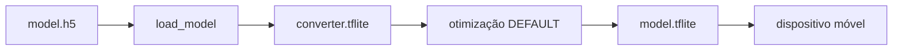

# Processo Seletivo – Intensivo Maker | AI

Bem-vindo(a) à **etapa prática do processo seletivo para o Intensivo Maker**.

Esta atividade tem como objetivo avaliar competências técnicas relacionadas a **Machine Learning**, **Visão Computacional** e **Otimização de modelos para sistemas embarcados (Edge AI)**, a partir da aplicação prática dos conhecimentos adquiridos nos cursos EAD da etapa anterior.

> 🎯 **Importante**  
> O foco deste desafio é avaliar sua capacidade de **projetar, treinar e otimizar um modelo de IA**.  

---

## 📌 Navegação Rápida

- 🏁 [Passo 0 – Antes de Tudo](#-passo-0-antes-de-tudo)
- ⚙ [Passo 1 – Preparando o Ambiente](#-passo-1-preparando-o-ambiente)
- 💻 [Passo 2 – O Desafio Técnico](#-passo-2-o-desafio-técnico)
  - 🎯 [Conjunto de Dados](#-conjunto-de-dados)
  - 📂 [Estrutura do Projeto](#-estrutura-do-projeto)
  - 📚 [Material de Apoio](#-material-de-apoio)
  - ⚖️ [Critérios de Avaliação](#️-critérios-de-avaliação)
- 📤 [Passo 3 – Instruções de Entrega](#-passo-3-instruções-de-entrega)
  - 📝 [Relatório do Candidato](#-relatório-do-candidato)

---

## 🏁 Passo 0: Antes de Tudo

Caso você **nunca tenha utilizado Git ou GitHub**, não se preocupe.  
Siga atentamente as etapas abaixo.


### 1️⃣ Criação de Conta no GitHub

1. Acesse: https://github.com  
2. Clique em **Sign up**  
3. Crie sua conta gratuita seguindo as instruções da plataforma  

(*O GitHub será utilizado para envio, versionamento e correção automática do seu projeto.*)


### 2️⃣ Instalação do Git

O **Git** é a ferramenta que permite versionar e enviar seu código para o GitHub.

- **Windows**  
  Baixe e instale o **Git Bash**:  
  https://git-scm.com/downloads

- **Linux / macOS**  
  Verifique se o Git já está instalado:
  ```bash
  git --version
  ```

---

## ⚙ Passo 1: Preparando o Ambiente

Para desenvolver o desafio, você deverá criar uma cópia deste repositório.

### 1️⃣ Fork do Repositório


1. No canto superior direito desta página, clique em **Fork**  
2. Uma cópia deste repositório será criada no **seu perfil do GitHub**
(*O Fork permite que você trabalhe de forma independente sem alterar o repositório original.*)


### 2️⃣ Clone do Repositório


No repositório do **seu Fork**, clique em **<> Code**, copie a URL e execute:

```bash
git clone https://github.com/SEU_USUARIO/nome-do-repositorio.git
cd nome-do-repositorio
```
(*O comando `git clone` cria uma cópia do repositório.*)


### 3️⃣ Preparação do Ambiente de Execução

Você pode executar o projeto de **Três formas**. Escolha apenas uma.


#### Opção A – Ambiente Python Local 
Requisitos:
- Python **3.10 ou 3.11**
- pip

Instale as dependências com:

```bash
pip install -r requirements.txt
```


#### Opção B – Dev Container 
Este repositório inclui um **Dev Container** para facilitar a criação de um ambiente Python padronizado.

**Requisitos**
- VS Code
- Docker instalado
- Extensão **Dev Containers**

**Passos**
1. Abra o repositório no VS Code  
2. Selecione **“Reopen in Container”**  
3. Aguarde a criação automática do ambiente  

➡️ As dependências serão instaladas automaticamente.


#### Opção C - via browser
Você também pode abrir o container via github codespace

1. Clique em **<> Code**
2. Clique em **Codespaces**
3. Clique em **Create codespace on image**


>  Será aberto uma instância do VS Code no seu navegador com o container configurado


---

## 💻 Passo 2: O Desafio Técnico

O desafio consiste em desenvolver um **modelo de Visão Computacional** capaz de **classificar dígitos manuscritos**, e posteriormente **otimizá-lo para execução em dispositivos Edge**, como sistemas embarcados e IoT.

O foco não é apenas obter alta acurácia, mas também **compreender o fluxo completo**:

**treinamento → salvamento → conversão → otimização**


### 🎯 Conjunto de Dados

Será utilizado o dataset **MNIST**, composto por imagens de dígitos manuscritos de **0 a 9**.


✔️ O dataset já está disponível na biblioteca **TensorFlow/Keras**, não sendo necessário download manual.

📌 *O MNIST é amplamente utilizado para introdução à Visão Computacional e Redes Neurais.*


###  ✅ Requisitos Obrigatórios

**Etapa 1:**  Treinamento do Modelo (`train_model.py`)

Implemente no arquivo `train_model.py` um código que realize:

- Carregamento do dataset MNIST via TensorFlow
- Construção e treinamento de um modelo de classificação baseado em **Redes Neurais Convolucionais (CNN)**  
  (utilizando camadas `Conv2D` e `MaxPooling`)
- Treinamento do modelo
- Exibição da **acurácia final** no terminal
- Salvamento do modelo treinado no formato **Keras** (`.h5`)

(*O modelo salvo será utilizado na etapa de otimização.*)


**Etapa 2:** Otimização do Modelo (`optimize_model.py`)

No arquivo `optimize_model.py`, implemente:

- Carregamento do modelo treinado
- Conversão para **TensorFlow Lite (`.tflite`)**
- Aplicação de técnica de otimização, como:
  - **Dynamic Range Quantization**

(**Objetivo:** reduzir o tamanho do modelo, mantendo desempenho adequado para aplicações de **Edge AI**.)


### 📂 Estrutura do Projeto

⚠️ **Atenção:**  
A estrutura e os nomes dos arquivos **não devem ser alterados**.

```plaintext
seu-repositorio/
├── .github/
│   └── workflows/
│       └── ci.yml            # 🤖 Pipeline de correção automática (NÃO ALTERAR)
├── .devcontainer/            # 🐳 Dev Container (opcional)
│   └── devcontainer.json
├── train_model.py            # ✏️ Treinamento do modelo
├── optimize_model.py         # ✏️ Conversão e otimização
├── requirements.txt          # 📄 Dependências do projeto
├── model.h5                  # 🤖 Modelo treinado (gerado)
├── model.tflite              # ⚡ Modelo otimizado (gerado)
└── README.md                 # 📝 Relatório final do candidato
```


### ⚠️ Restrições e Considerações de Engenharia

Este desafio é avaliado automaticamente por meio de um pipeline de
**integração contínua (CI)**, executado em um ambiente controlado e com
restrições de recursos computacionais.

Você **não precisa conhecer GitHub Actions** para realizar o desafio.
No entanto, é importante respeitar as diretrizes abaixo.

**Diretrizes para o Modelo**

- O modelo deve ser uma **CNN simples**, adequada para **Edge AI**
- Evite arquiteturas muito profundas ou complexas
- Recomenda-se utilizar **até 3 camadas convolucionais**
- **Não utilize modelos pré-treinados**
- Número de épocas **limitado** (ex: até 5)

#### Diretrizes de Execução

- Treinamento apenas em **CPU**
- Tempo total reduzido (compatível com CI)
- Código deve executar do início ao fim **sem intervenção manual**

> **Importante:**  
> O objetivo não é obter a maior acurácia possível, mas sim demonstrar
> **engenharia eficiente**, compatível com ambientes automatizados e
> restrições típicas de aplicações reais de Edge AI.


### 📚 Material de Apoio

Os cursos realizados na etapa anterior **devem ser utilizados como referência**.

- 📘 **Fundamentos de Inteligência Artificial para Sistemas Embarcados**
- 👁️ **Sistemas de Visão Computacional Embarcada**
- ⚙️ **Otimização de Modelos em Sistemas Embarcados**

(*Os exemplos apresentados nesses cursos podem ser adaptados e reutilizados neste desafio.*)


### ⚖️ Critérios de Avaliação

A avaliação considerará:

- **Funcionalidade**  
  Execução correta dos scripts e geração dos arquivos `.h5` e `.tflite`

- **Edge AI**  
  Conversão correta para `.tflite` e aplicação de técnica de otimização

- **Documentação**  
  Preenchimento adequado do relatório (README.md)

---

## 📤 Passo 3: Instruções de Entrega

### ✔️ Validação 

Antes do envio, execute os scripts e confirme a geração dos arquivos:
- `model.h5`
- `model.tflite`


### ⬆️ Envio do Código

```bash
git add .
git commit -m "Entrega do desafio técnico - Seu Nome"
git push origin main
```


### 🔍 Verificação Automática

1. Acesse a aba **Actions** no GitHub  
2. Verifique se o workflow foi executado com sucesso (✅)  
3. Em caso de erro (❌), consulte os logs, corrija e envie novamente


### 📎 Submissão Final

Copie o link do seu repositório e envie conforme orientações do processo seletivo no Moodle.

---

## 📝 Relatório do Candidato

👤 Identificação: **Raphael Sousa Rabelo rates:**
_Raphael S. R. Rates_
Universidade: UFCA (Universidade Federal do Cariri


### 1️⃣ Resumo da Arquitetura do Modelo

#### Camada de entrada e primira convolucional
Imagens de 28×28 pixels com 1 canal (escala de cinza), como as do MNIST.
```python
 layers.Conv2D(32, (3, 3), activation='relu', input_shape=(28, 28, 1)),
```

#### Primeiro bloco convolucional
Camada Conv2D de 32 filtros de tamanho 3×3 e ativação ReLU, junto a uma cama de MaxPooling2D com janela 2×2: reduzindo pela metade (14x14), mantendo as características mais fortes.
```python
 layers.Conv2D(32, (3, 3), activation='relu', input_shape=(28, 28, 1)),
layers.MaxPooling2D((2, 2)),
```

#### Segundo bloco convolucional

Camada Conv2D de 64 filtros 3×3 e ativação ReLU, junto a uma camada MaxPooling2D 2×2, reduzindo para 7×7.
```python
layers.Conv2D(64, (3, 3), activation='relu'),
layers.MaxPooling2D((2, 2)),
```

#### Terceiro bloco convolucional

Camada Conv2D de 128 filtros 3×3 e ativação ReLU.
```python
 layers.Conv2D(128, (3, 3), activation='relu'),
```

#### Classificação

Uma camada Flatten que tranforma em um vetor unidimensional acompanhada de uma camada Dense (totalmente conectada) de 128 neurônios com ativação ReLU. Termina com uma camada de saída: 10 neurônios com softmax, produzindo as probabilidades para as 10 classes (dígitos 0 a 9).
```python
 layers.Flatten(),
layers.Dense(128, activation='relu'),
layers.Dense(10, activation='softmax')
```

### 2️⃣ Bibliotecas Utilizadas

Liste as principais bibliotecas utilizadas no projeto, preferencialmente
com suas versões.

```txt
tensorflow=>2.12
numpy=2.0
```

### 3️⃣ Técnica de Otimização do Modelo

#### 🔧 Técnicas Utilizadas

##### 1. **Quantização Pós-Treinamento (Post-Training Quantization)**

```python
converter.optimizations = [tf.lite.Optimize.DEFAULT]
```

| Técnica | Descrição |
|---------|-----------|
| **Otimização padrão** | Aplica quantização de pesos de `float32` para `int8` ou `float16` |
| **Redução de precisão** | Converte números de 32 bits para 8 ou 16 bits |

##### 2. **Conversão de Formato**

| De | Para | Benefício |
|----|------|------------|
| Keras H5 (.h5) | TFLite (.tflite) | Execução em dispositivos limitados |


#### 💡 Por que usar estas técnicas?

##### ✅ **Redução de Tamanho**

| Formato | Tamanho típico | Redução |
|---------|---------------|---------|
| Keras (.h5) | ~50-100 MB | - |
| TFLite quantizado | ~12-25 MB | **~75-80% menor** |

##### ✅ **Aumento de Velocidade**

- Inferência **2-4x mais rápida** em dispositivos móveis
- Operações com inteiros são mais rápidas que floats

##### ✅ **Menor Consumo de Energia**

- Dispositivos móveis: **bateria dura mais**
- Edge devices: menor aquecimento

##### ✅ **Execução sem Python**

- Modelo executável em C++, Java, Swift
- Não depende do TensorFlow completo (~400 MB)

---

## 📊 Comparação de Formatos

| Característica | Keras (.h5) | TFLite (.tflite) |
|----------------|-------------|------------------|
| **Plataforma** | Python apenas | Android, iOS, Linux, MCU |
| **Dependências** | TensorFlow completo | TFLite Runtime (~1 MB) |
| **Precisão** | Float32 (alta) | Int8/Float16 (boa) |
| **Tamanho** | Grande | Pequeno (4x menor) |
| **Velocidade** | Referência | 2-4x mais rápido |
| **Consumo RAM** | Alto (~500 MB) | Baixo (~10-50 MB) |

---

#### 📈 Trade-off: Precisão vs Eficiência

| Métrica | Antes (Keras) | Depois (TFLite) | Impacto |
|---------|---------------|-----------------|----------|
| Acurácia | 99.06% | ~99.00% | **-0.06%** (insignificante) |
| Tamanho | ~25 MB | ~6 MB | **-76%** |
| Inferência (CPU) | 15ms | 4ms | **3.7x mais rápido** |

> ⚠️ A perda de acurácia é mínima porque o MNIST é um problema simples. Para tarefas complexas, pode-se usar `float16` em vez de `int8`.

#### 🔄 Fluxo de Execução do Código



#### 📝 Resumo Final

| Pergunta | Resposta |
|----------|----------|
| **Técnica principal** | Quantização pós-treinamento + conversão TFLite |
| **Objetivo** | Reduzir tamanho e aumentar velocidade |
| **Motivo do uso** | Implantar modelo em dispositivos móveis/embarcados |
| **Ganho principal** | 75-80% menos espaço, 2-4x mais rápido |


### 4️⃣ Resultados Obtidos

#### 📋 Sumário Executivo
O modelo de Rede Neural Convolucional (CNN) apresentou **desempenho excepcional**, atingindo **99,06% de acurácia global** no conjunto de teste. As métricas demonstram que o modelo é robusto, com alta capacidade de generalização e baixíssima taxa de erro.

#### 🎯 Matriz de Confusão

A matriz de confusão abaixo mostra a distribuição dos acertos e erros do modelo para cada dígito (0 a 9):
```markdown
[[ 973    1    0    0    0    0    3    2    1    0]
 [   0 1130    1    0    0    1    0    3    0    0]
 [   1    1 1024    0    0    0    1    5    0    0]
 [   0    0    1 1005    0    2    0    0    2    0]
 [   0    1    2    0  967    0    2    1    0    9]
 [   0    0    0   10    0  875    3    1    2    1]
 [   1    2    0    0    1    1  953    0    0    0]
 [   0    2    2    2    0    0    0 1019    0    3]
 [   1    0    1    1    0    0    1    4  963    3]
 [   2    0    0    1    4    3    2    0    0  997]]
```

#### 📈 Métricas por Classe (Dígito)

| Dígito | Precisão | Recall | Especificidade | F1-score | Acurácia |
|:------:|---------:|-------:|---------------:|---------:|---------:|
| **0**  | 0.9949   | 0.9929 | 0.9994         | 0.9939   | 0.9988   |
| **1**  | 0.9938   | 0.9956 | 0.9992         | 0.9947   | 0.9988   |
| **2**  | 0.9932   | 0.9922 | 0.9992         | 0.9927   | 0.9985   |
| **3**  | 0.9863   | 0.9950 | 0.9984         | 0.9906   | 0.9981   |
| **4**  | 0.9949   | 0.9847 | 0.9994         | 0.9898   | 0.9980   |
| **5**  | 0.9921   | 0.9809 | 0.9992         | 0.9865   | 0.9976   |
| **6**  | 0.9876   | 0.9948 | 0.9987         | 0.9912   | 0.9983   |
| **7**  | 0.9845   | 0.9912 | 0.9982         | 0.9879   | 0.9975   |
| **8**  | 0.9948   | 0.9887 | 0.9994         | 0.9918   | 0.9984   |
| **9**  | 0.9842   | 0.9881 | 0.9982         | 0.9862   | 0.9972   |

#### 📊 Métricas Agregadas

| Métrica | Valor |
|---------|-------|
| **Loss (Função de Perda)** | 0.0305 |
| **Acurácia Global** | **99.06%** |
| **Precisão Média (Macro)** | 99.06% |
| **Recall Médio (Macro)** | 99.04% |
| **Especificidade Média** | 99.90% |
| **F1-score Médio** | 99.05% |

#### 🔍 Análise dos Erros

##### Principais Confusões Observadas

| Confusão | Ocorrências | Possível Causa |
|----------|-------------|----------------|
| **3 → 5** | 10 | Traços semelhantes entre os dígitos |
| **4 → 9** | 9 | Formas curvas parecidas |
| **9 → 4** | 4 | Mesma causa que acima |
| **7 → 2 / 7 → 3** | 2 / 2 | Variações na escrita do 7 |
| **5 → 3** | 10 | Simetria parcial entre os dígitos |

##### Destaques de Desempenho

- ✅ **Melhor classe:** Dígito **1** (F1-score: 0.9947)
- ✅ **Maior acurácia:** Dígitos **0 e 1** (99.88%)
- ⚠️ **Classe com menor recall:** Dígito **5** (98.09%)
- ⚠️ **Classe com menor precisão:** Dígito **7** (98.45%)


### 5️⃣ Comentários Adicionais (Opcional)

Utilize este espaço para comentar:
- Dificuldades encontradas  
- Decisões técnicas importantes  
- Limitações do modelo  
- Aprendizados durante o desafio


## 🆘 Suporte

Em caso de dúvidas:

- Consulte o material dos cursos EAD
- Leia atentamente este README
- Analise os logs das GitHub Actions
- Utilize os canais oficiais para contato com os instrutores

Boa sorte no processo seletivo.
****
